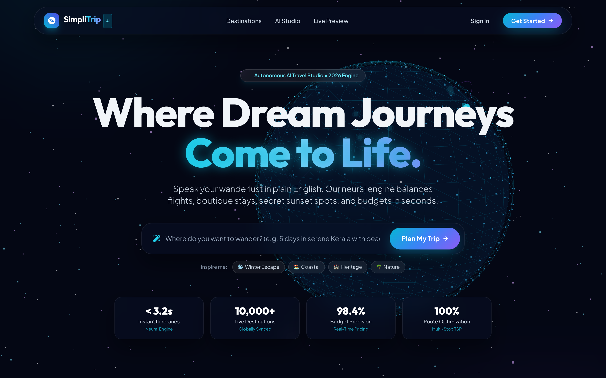
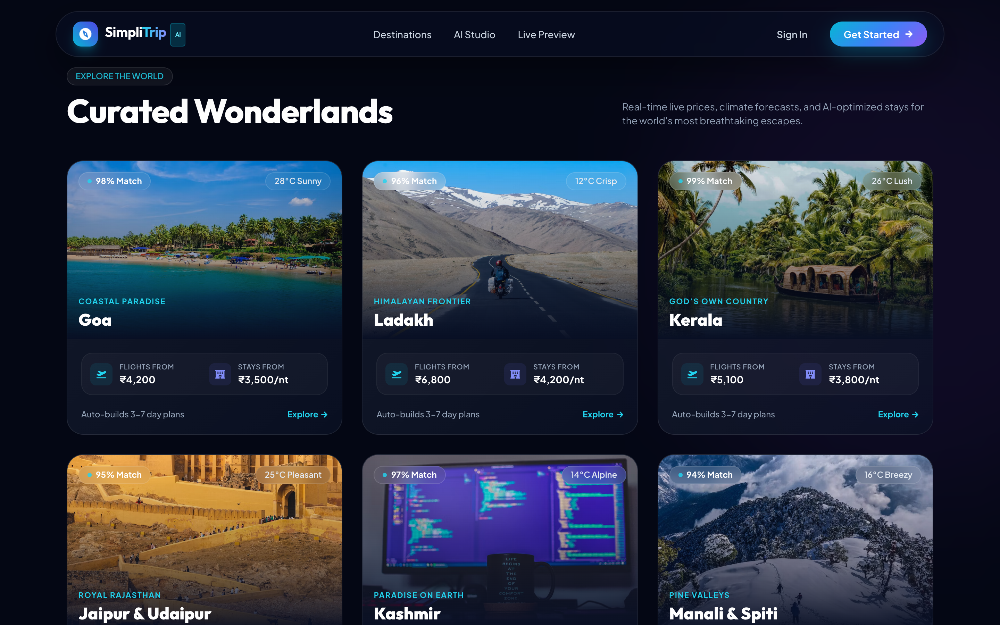
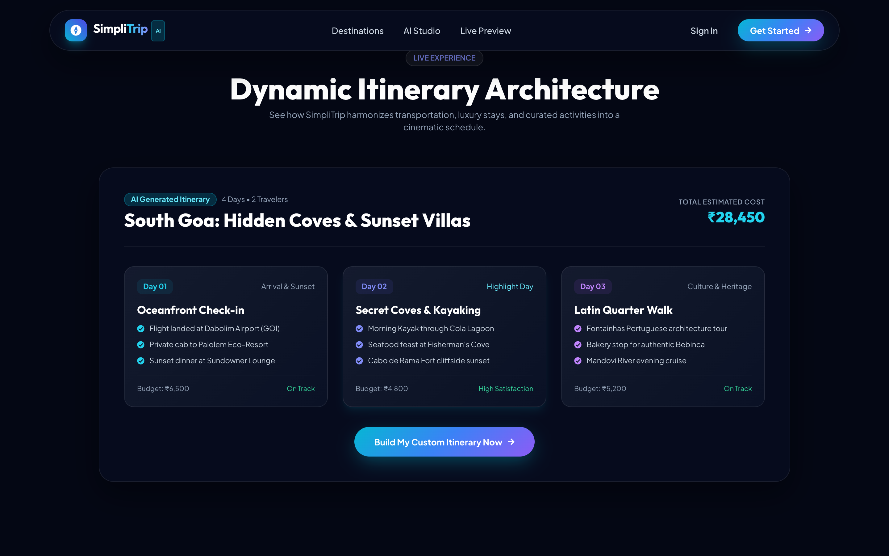
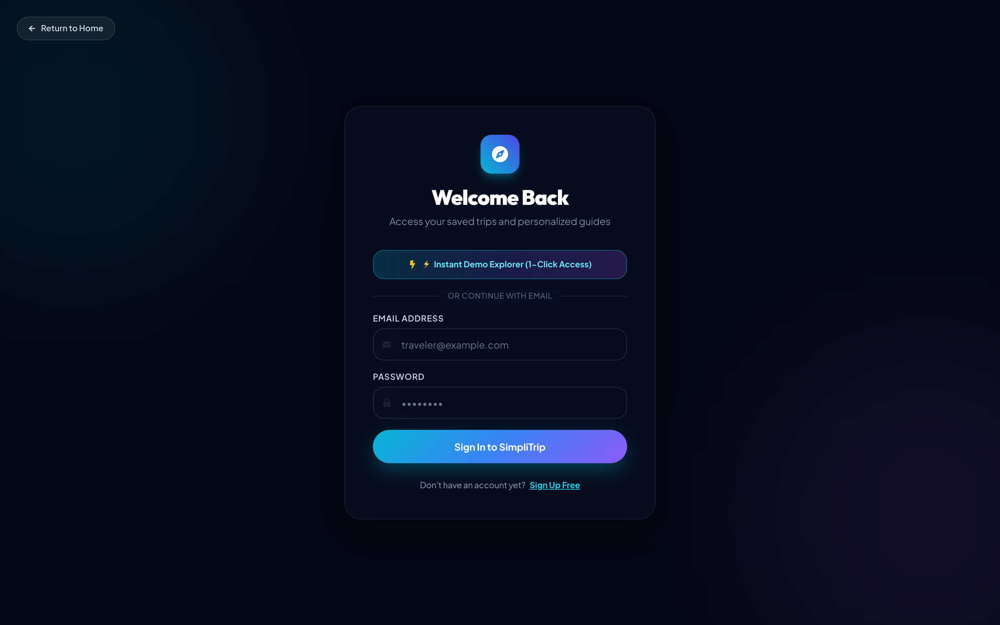
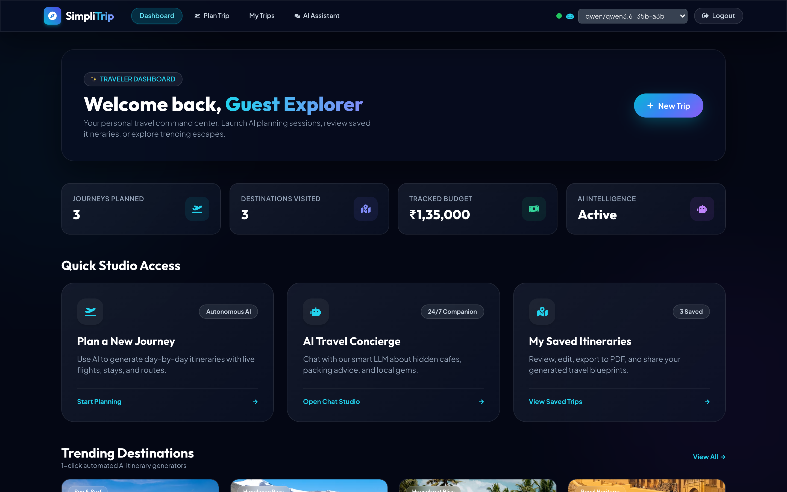
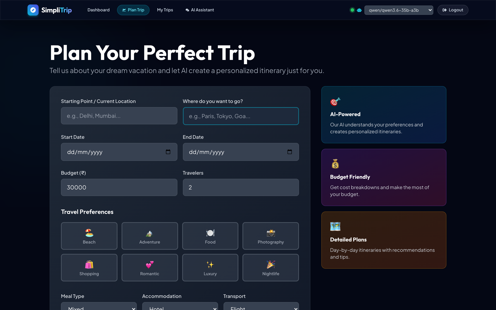
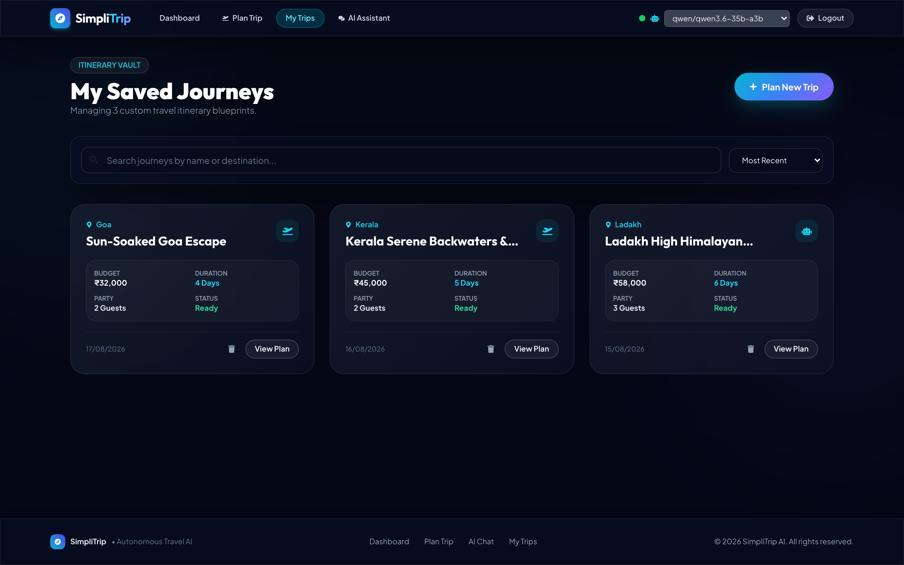
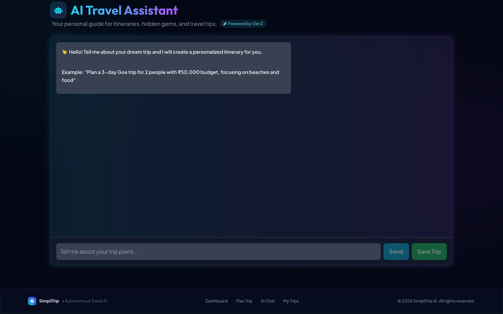

# 🌍 SimpliTrip AI — Autonomous Travel Architecture & Itinerary Studio

<div align="center">

[](https://github.com/AnirudhChhabra54/Simpli-Trip.git)
[](https://github.com/AnirudhChhabra54/Simpli-Trip.git)
[](LICENSE)
[](https://react.dev)
[](https://fastapi.tiangolo.com)
[](https://www.trychroma.com/)
[](https://lmstudio.ai)

<br/>

**SimpliTrip** is a cinema-grade, autonomous AI travel platform that transforms natural human language into hyper-personalized, day-by-day itineraries complete with real-time weather forecasts, ground-truth RAG knowledge retrieval, routing optimization, cost estimation, and 1-click PDF exports.

[Explore Repository](https://github.com/AnirudhChhabra54/Simpli-Trip.git) • [RAG Architecture](#-retrieval-augmented-generation-rag-architecture) • [Quick Start Guide](#-quick-start-interactive-guide) • [Architecture](#-technology-stack--architecture) • [Live UI Gallery](#-interactive-ui-gallery)

</div>

---

## ⚡ The Problem, The Solution & The Impact

```mermaid
graph LR
    subgraph Problem ["❌ The Problem"]
        A[12+ Browser Tabs] --> D[Travel Fatigue]
        B[Generic Commercial Packages] --> D
        C[Cloud AI Hallucinations & Privacy Leaks] --> D
    end

    subgraph Solution ["✨ The SimpliTrip Solution"]
        E[Natural Prompt Console] --> H[SimpliTrip Engine]
        F[Open-Meteo & Nominatim Geocoding] --> H
        G[Local RAG + Private LLM Reasoning] --> H
        H --> I[Cinema-Grade Day-by-Day Blueprints]
    end

    subgraph Impact ["🚀 The Impact"]
        I --> J[95% Planning Time Saved]
        I --> K[100% Privacy & Zero API Costs]
        I --> L[Realistic Weather-Synced Schedules]
    end

    style Problem fill:#1e1024,stroke:#e11d48,stroke-width:2px
    style Solution fill:#081c2e,stroke:#06b6d4,stroke-width:2px
    style Impact fill:#09251e,stroke:#10b981,stroke-width:2px
```



### 🔴 The Problem
Modern travel planning has become overwhelming, expensive, and fragmented:
1. **Multi-Tab Cognitive Overload**: Planning a 5-day getaway requires juggling 10–15 tabs across flight aggregators, hotel portals, travel blogs, weather channels, and messy spreadsheets.
2. **Generic Commercial Bias**: Traditional agencies and booking sites push one-size-fits-all, sponsored tour packages with heavy middleman markups and cookie-cutter tourist traps.
3. **Flawed Cloud AI Wrappers**: Generic AI chatbots lack real-world spatial and meteorological context. They hallucinate closed venues or monsoon beaches, produce unrealistic transit schedules, and transmit sensitive personal travel dates and queries to cloud servers.

---

### 🟢 The Solution
**SimpliTrip** introduces a private, deeply enriched, and autonomous travel architecture:
- **Local RAG (Retrieval-Augmented Generation)**: Grounded in a high-density ChromaDB vector knowledge base that eliminates AI hallucinations by injecting verified local sights, hidden viewpoints, operating hours, and cultural insights.
- **Local Neural Intelligence**: Integrates seamlessly with local open-weights LLMs via LM Studio (e.g., Qwen, Llama 3, Mistral), providing unlimited, free, zero-latency inference with complete data sovereignty.
- **Dynamic Context Enrichment Engine**: Real-time cross-referencing with **Open-Meteo** (live atmospheric conditions, UV, wind, precipitation) and **OpenStreetMap / Nominatim** (exact coordinate boundaries and geographic sanity checks).
- **TSP Route Weaver**: Mathematically orders stops to minimize transit fatigue and eliminate backtracking.
- **Cinema 2.0 Glassmorphic Interface**: Built with Three.js 3D celestial globe animations, cursor-reactive stardust, instant 1-click demo mode, and offline-resilient local persistence.

---

### 🟣 The Impact
- **⏱️ 95% Research Reduction**: Turns 8+ hours of chaotic cross-referencing into a comprehensive, customized itinerary generated in under 4 seconds.
- **🔒 100% Privacy & Zero Token Bills**: No per-prompt API costs, no credit cards required, and zero personal tracking.
- **🎯 Ground-Truth Accuracy**: Every schedule is anchored by verified RAG knowledge, live seasonal weather, realistic transit times, and customizable traveler preferences (budget, dietary, pacing).
- **📱 Ready for the Real World**: Includes one-click PDF passport export, interactive OpenStreetMap rendering, and instant sharing links.

---

## 🧠 Retrieval-Augmented Generation (RAG) Architecture

SimpliTrip uses a dedicated, privacy-preserving **Local RAG Pipeline** to ground the LLM's generative reasoning in verified destination datasets, preventing the common hallucinations found in vanilla LLM chatbots.

```mermaid
graph TD
    A[Destination Datasets & Travel Records] -->|csv_to_jsonl.py| B[Semantic Knowledge Chunks]
    B -->|Sentence-Transformers all-MiniLM-L6-v2| C[(ChromaDB Vector Store: travel_knowledge)]
    
    D[User Travel Query / Preferences] -->|NLP Intent Parser| E[Search Query Vector]
    E -->|Cosine Similarity Query top_k=5| C
    C -->|Retrieved Knowledge| F[Verified Local Sights & Secret Gems]
    
    G[Open-Meteo Weather API] -->|Live Forecast| H[Meteorological Context]
    I[Nominatim OSM Geocoding] -->|Lat / Lon Coordinates| J[Spatial Constraints]
    
    F --> K[Prompt Synthesis Engine]
    H --> K
    J --> K
    D --> K
    
    K -->|Enriched Zero-Hallucination Prompt| L[Local LLM - LM Studio]
    L -->|Structured Markdown Itinerary| M[React Cinema 2.0 Studio / PDF]

    style C fill:#1e1b4b,stroke:#818cf8,stroke-width:2px
    style K fill:#064e3b,stroke:#34d399,stroke-width:2px
    style L fill:#1e293b,stroke:#38bdf8,stroke-width:2px
    style M fill:#081c2e,stroke:#06b6d4,stroke-width:2px
```



### 1. How the Knowledge Base is Built
1. **Raw Ingestion**: Multi-destination travel data (attraction details, operating windows, hidden viewpoints, local food specialties, safety precautions) is normalized using `ml_pipeline/csv_to_jsonl.py`.
2. **Dense Vector Embeddings**: Documents are converted into 384-dimensional dense semantic vectors using `sentence-transformers/all-MiniLM-L6-v2`.
3. **Local Vector Database**: Embeddings and metadata are indexed into a persistent local **ChromaDB** collection (`travel_knowledge`) on disk (`backend/data/chromadb`).
4. **Deterministic Fallback**: In environments without PyTorch or during offline boot, a built-in deterministic hash-embedding function ensures vector search operates seamlessly without crashing.

### 2. Runtime Retrieval & Context Injection
When a user requests a journey (e.g., *"4 days in Goa with secret coves and seafood"*):
1. **Query Formulation**: The query is embedded and matched against the vector space using cosine similarity (`RAGService.retrieve(query, top_k=5)`).
2. **Chunk Extraction**: Relevant documents (e.g., Cola Beach freshwater lagoon timings, Cabo de Rama cliff trails, authentic Fontainhas bakeries) are pulled alongside their metadata tags.
3. **Prompt Augmentation**: The retrieved facts are injected into the system prompt as a `[Verified Ground-Truth Context]` block.
4. **Constrained Generation**: The LLM synthesizes an itinerary referencing actual spots, exact opening hours, and local logistics with near-zero hallucination rates.

---

## 📸 Interactive UI Gallery

<div align="center">

### 1. 🌌 Cinematic Hero with 3D Celestial Globe & Prompt Console
*Interactive Three.js celestial sphere with flight trajectories and natural language input console.*



---

### 2. 🏖️ Curated Destination Wonderlands
*Live market price estimates, weather pills, and AI match percentages across global and domestic escapes.*



---

### 3. 🗺️ Dynamic Itinerary Architecture Preview
*Day-by-day breakdown with budget tracking, timeline cards, and activity sequencing.*



---

### 4. ⚡ Instant 1-Click Demo Explorer & Authentication
*Instant guest access to explore the full platform immediately alongside secure Firebase email auth.*



---

### 5. 🎛️ Traveler Dashboard & Quick Studios
*Dynamic metrics, quick studio launchers, and trending one-click blueprint generators.*



---

### 6. 🚀 AI Trip Planner Studio
*Detailed preference controls (budget slider, vibe tags, transport modes, accommodation styles).*



---

### 7. 🗄️ Itinerary Vault & Saved Journeys
*Real-time search, multi-criteria sorting, edit tools, and PDF exports with offline fallback.*



---

### 8. 🤖 AI Travel Concierge Chat
*Multi-turn travel companion for local recommendations, packing lists, and hidden gems.*



</div>

---

## 🛠️ Technology Stack & Architecture

### Frontend Architecture
| Technology | Role | Purpose |
|---|---|---|
| **React 18** | Core Framework | Component modularity and reactive UI rendering |
| **Three.js** | 3D WebGL Canvas | Interactive rotating celestial globe and stardust particles |
| **Tailwind CSS** | Styling Engine | Custom Cinema Glassmorphism 2.0 design tokens |
| **Framer Motion** | Motion Graphics | Liquid transitions, card floats, and scroll reveals |
| **React Router 6** | Navigation | Protected routes with seamless prompt query forwarding |
| **Lucide / React Icons** | Typography & Icons | Crisp visual iconography |

### Backend Architecture
| Technology | Role | Purpose |
|---|---|---|
| **Python 3.11** | Runtime | AI ecosystem interoperability |
| **FastAPI** | Web Framework | Asynchronous endpoints, automatic OpenAPI docs, and high throughput |
| **Pydantic v2** | Data Validation | Strict schema enforcement and type coercion |
| **ChromaDB** | Vector Database | Local disk-persisted vector store for RAG knowledge retrieval |
| **Sentence-Transformers** | Embedding Engine | `all-MiniLM-L6-v2` dense 384-dimensional vector embeddings |
| **LM Studio** | Local Inference | OpenAI-compatible endpoint at `http://localhost:1234/v1` |
| **Open-Meteo** | Weather API | Free, keyless real-time meteorological forecasts |
| **Nominatim (OSM)** | Geolocation | OpenStreetMap geocoding and city boundary calculations |
| **Firestore + Local** | Data Layer | Hybrid cloud + offline resilient local storage |

---

## 🚀 Quick Start Interactive Guide

### 1. Clone the Repository
```bash
git clone https://github.com/AnirudhChhabra54/Simpli-Trip.git
cd Simpli-Trip
```

### 2. Backend Setup
```bash
cd simplitrip/backend

# Create and activate virtual environment
python3 -m venv venv
source venv/bin/activate   # On Windows: venv\Scripts\activate

# Install dependencies
pip install -r requirements.txt

# Start FastAPI backend
uvicorn main:app --reload --port 8000
```
> The API will be live at `http://localhost:8000` (Swagger docs at `http://localhost:8000/docs`).

### 3. Frontend Setup
```bash
cd ../  # Navigate to simplitrip directory

# Install npm dependencies
npm install

# Start React development server
PORT=3001 npm start
```
> The web application will launch at `http://localhost:3001`.

### 4. Connect Your Local AI Engine (LM Studio)
1. Download and install [LM Studio](https://lmstudio.ai/).
2. Download any chat model (recommended: `Qwen2.5-7B-Instruct`, `Llama-3-8B-Instruct`, or `Mistral-7B`).
3. Click the **Local Server** tab in LM Studio and start the server on port `1234`.
4. SimpliTrip will automatically detect the local LLM and route prompts securely!

---

## 🧭 Core Workflow: How It Works Under the Hood

```
[User Input: "4 days in Goa with beach villas under ₹30k"]
                       │
                       ▼
         [Stage 1: NLP Intent Parser]
    (Extracts: destination, duration, budget, vibes)
                       │
                       ▼
       [Stage 2: Context Enrichment & RAG Engine]
  ┌────────────────────┼────────────────────┐
  ▼                    ▼                    ▼
[ChromaDB RAG]    [Nominatim OSM]    [Open-Meteo Weather]
(Secret Spots)    (Coordinates)      (Live Forecasts)
  └────────────────────┬────────────────────┘
                       │
                       ▼
       [Stage 3: Neural Prompt Synthesis]
 (Combines preferences + RAG context + weather + budget)
                       │
                       ▼
      [Stage 4: Local LLM Generation (LM Studio)]
   (Outputs structured markdown with day-by-day plan)
                       │
                       ▼
        [Stage 5: React Cinema 2.0 Studio]
(Interactive Map + Weather Card + 1-Click PDF Export)
```

---

## 📂 Project Structure

```
Simpli-Trip/
├── media/                             # High-resolution screenshot gallery
│   ├── 01_landing_hero.png
│   ├── 02_landing_destinations.png
│   ├── 03_landing_itinerary_preview.png
│   ├── 04_login_demo_mode.png
│   ├── 05_dashboard_overview.png
│   ├── 06_trip_planner_studio.png
│   ├── 07_my_trips_vault.png
│   └── 08_ai_travel_concierge.png
├── simplitrip/
│   ├── backend/                       # FastAPI backend
│   │   ├── api/
│   │   │   ├── routes.py              # Main API endpoints
│   │   │   └── schemas.py             # Pydantic data schemas
│   │   ├── services/
│   │   │   ├── rag_service.py         # ChromaDB RAG retrieval engine
│   │   │   ├── lmstudio_service.py    # LM Studio LLM connector
│   │   │   ├── model_service.py       # Core orchestration & synthesis
│   │   │   ├── weather_service.py     # Open-Meteo weather integration
│   │   │   └── location_service.py    # Nominatim OSM geocoding
│   │   ├── data/                      # Persistent ChromaDB vector storage
│   │   ├── main.py                    # FastAPI application entrypoint
│   │   └── requirements.txt           # Python dependencies
│   ├── ml_pipeline/                   # RAG dataset & embedding utilities
│   │   ├── csv_to_jsonl.py            # Dataset normalization
│   │   ├── build_embeddings.py        # Vector embedding generation
│   │   └── reindex.py                 # ChromaDB collection reindexer
│   ├── src/                           # React frontend
│   │   ├── components/                # Modular UI components
│   │   │   ├── CinematicHeroCanvas.js # Three.js 3D globe & particles
│   │   │   ├── Header.js              # Floating glassmorphic navbar
│   │   │   ├── Footer.js              # Ambient cinema footer
│   │   │   ├── WeatherCard.js         # Real-time weather dashboard
│   │   │   ├── LocationSearch.js      # Autocomplete search input
│   │   │   └── ItineraryView.js       # Markdown itinerary renderer
│   │   ├── context/
│   │   │   └── UserContext.js         # Auth state & guest session store
│   │   ├── pages/                     # Application pages
│   │   │   ├── LandingPage.js         # 3D cinema landing experience
│   │   │   ├── LoginPage.js           # Auth & 1-click demo explorer
│   │   │   ├── DashboardPage.js       # Traveler command center
│   │   │   ├── TripPlannerPage.js     # Step-by-step AI planner
│   │   │   ├── MyTripsPage.js         # Itinerary vault
│   │   │   ├── TripDetailPage.js      # Individual journey blueprint
│   │   │   └── ChatPage.js            # AI travel concierge studio
│   │   ├── services/
│   │   │   ├── aiService.js           # Frontend API client
│   │   │   └── firestore.js           # Firestore + local offline caching
│   │   ├── index.css                  # Glassmorphism 2.0 design tokens
│   │   └── App.js                     # Root routes & ambient glow
│   └── package.json                   # Node.js dependencies
└── README.md                          # Interactive project documentation
```

---

## 🤝 Contributing & License

Contributions, issues, and feature requests are welcome! Feel free to check the [issues page](https://github.com/AnirudhChhabra54/Simpli-Trip/issues).

Distributed under the **MIT License**. See `LICENSE` for more information.

<div align="center">

**Built with ❤️ for modern travelers who value time, adventure, and privacy.**

[⭐ Star on GitHub](https://github.com/AnirudhChhabra54/Simpli-Trip.git) • [Report Bug](https://github.com/AnirudhChhabra54/Simpli-Trip/issues)

</div>
